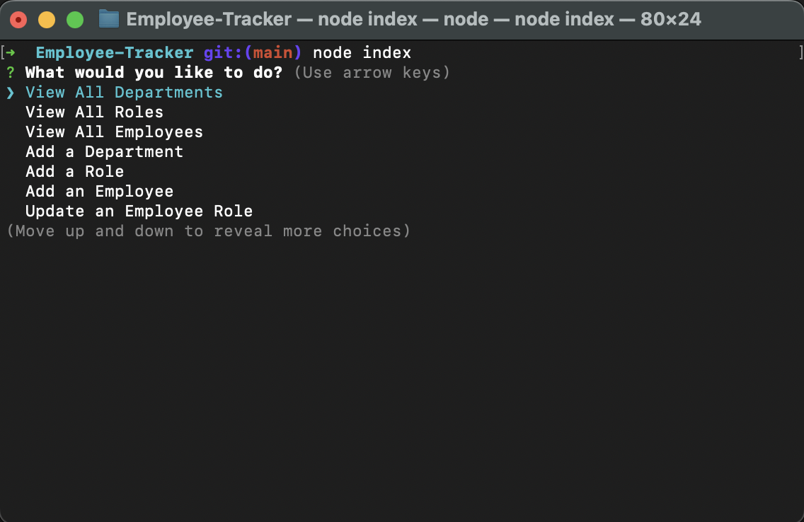
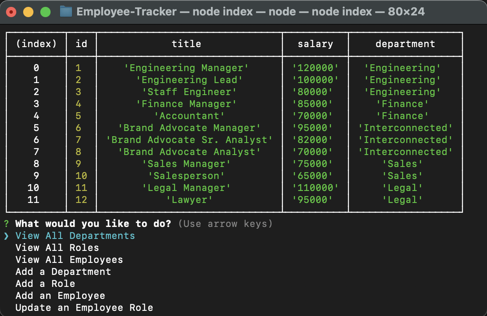

# Employee-Tracker

## Description
  A management system that allows users to view and interact with and view different departments and staff members information by using Node.js, Inquirer, and MySQL. Employers are able to manage and view all of the company's departments, employees, and their roles, simply by starting up the app. Employers can even add new department, employees, roles, or even update a current employee's role, if they wish. 

  ## Installation
  - Run "npm install" to install everything needed.

  ## Contributing
  N/A

  ## Questions?
  Feel free to ask any questions you may have by reaching out to the following:

  Github: https://github.com/Austin1094
  Email: Austin.Adams1094@gmail.com